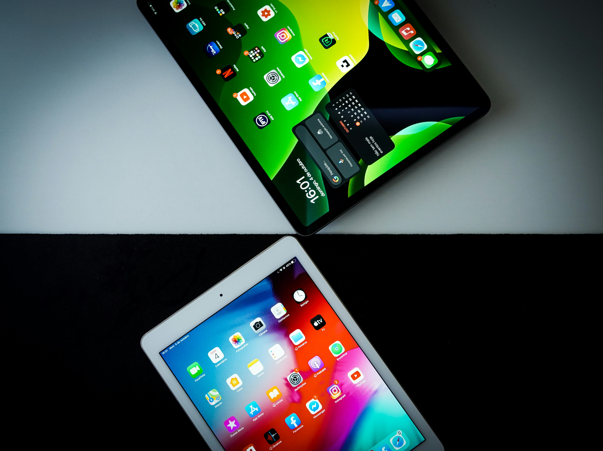
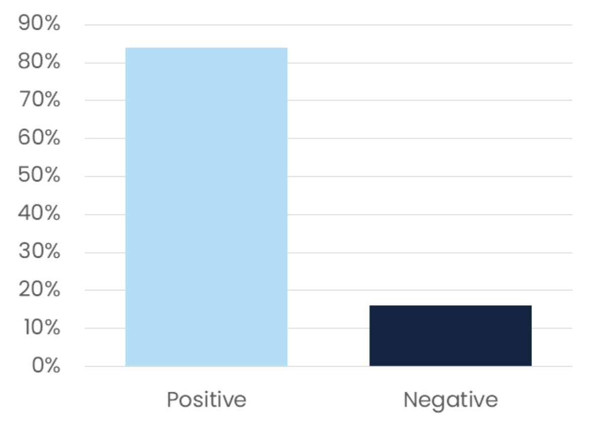
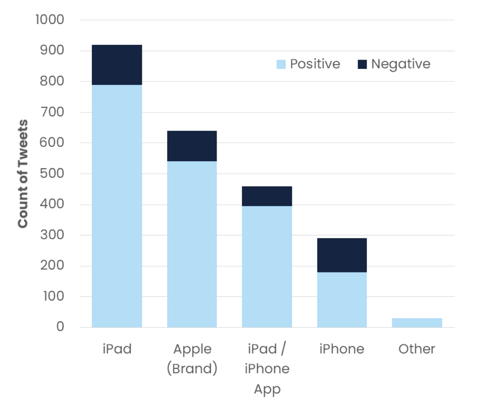
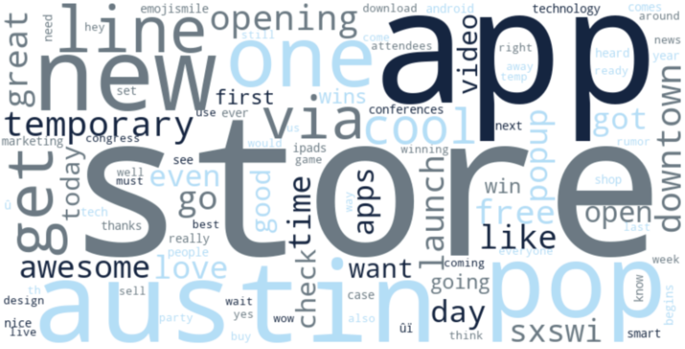
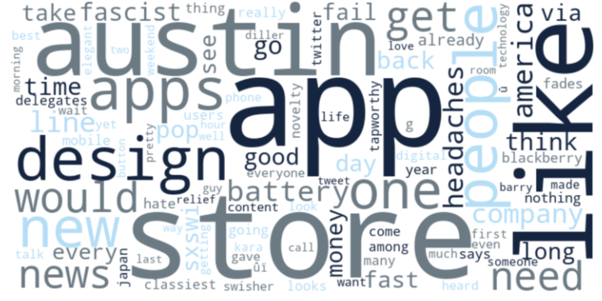
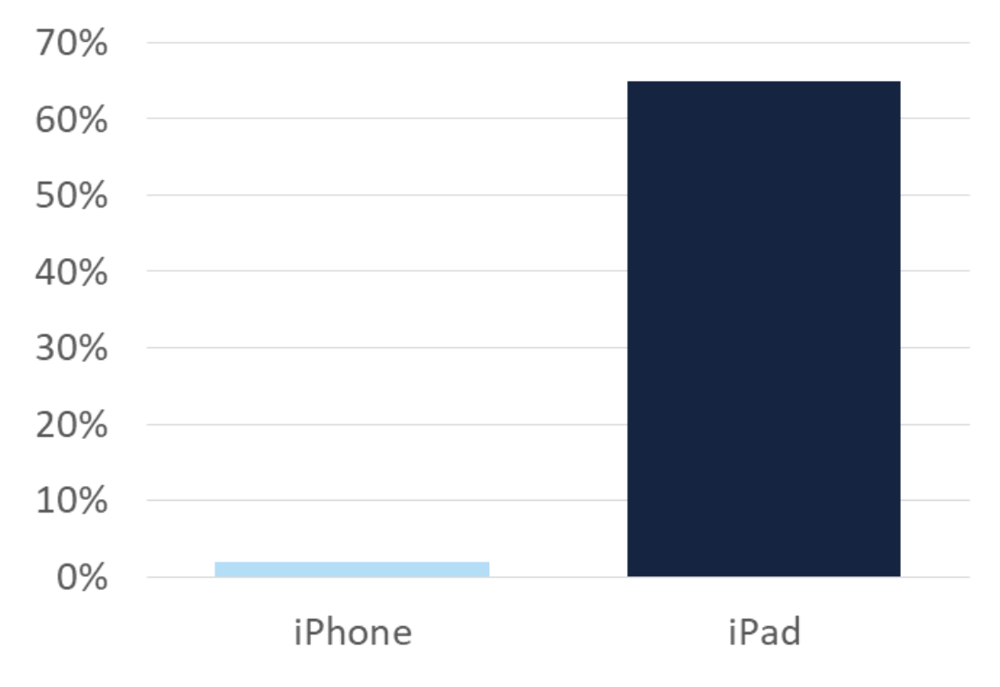

# Apple Sentiment Analysis at the SXSW 2013 Conference
by Rick Lataille, Sarah Prusaitis, and Allison Ward

## Repository contents:
- Data folder containing .csv files of the datset and synthetically generated tweets
- Jupyter notebook saved as index.ipynb
- Powerpoint presentation saved as presentation.pdf

## Overview

This project analyzes the overall sentiment towards Apple products at the SXSW conference in 2013 through the tweets of conference attendees. The SXSW conference is a yearly event in Austin, Texas that revolves around technology, education, music, culture, and politics. The goal is to understand how the public perceives Apple products during this high-profile event and to identify trends or patterns in sentiment. This information will help make data-driven decisions for future product launches and marketing campaigns.

## Data Overview
Data was provided from CrowdFlower and downloaded from data.world. Tweets were labeled as positive, negative, neutral, or uncertain in emotion by human raters. 

## Data Exploration, Cleaning and Preprocessing

In order to better analyze the contents of positive and negative sentiments, neutral or uncertain tweets were dropped. The resounding sentiment towards Apple products at the conference was positive. 

### Overall sentiment:

### Product sentiment:

Word clouds were created to visualize the top 100 words in tweets rated as either positive or negative. This provided clear insights into the reasoning of conference attendee’s sentiments toward Apple. 

### Top 100 positive tweets wordcloud:

### Top 100 negative tweets wordcloud:

Before the modeling process class imbalance was addressed, as positive tweets accounted for significantly more tweets than those with negative sentiment. To balance the data, chatGPT was prompted with example negative tweets to synthetically create 1,477 negative tweets, ensuring they followed the formatting of the original dataset and were relevant to the 2013 SXSW conference.

Preprocessing and feature engineering methods included:
- Converting emoticons to unique strings
- Removing semantically meaningless patterns (mentions, links, etc)
- Adding limited additional stopwords that likely have no semantic meaning
- Unigram Tokenization, POS-tagging and Lemmatization
- TF-IDF Vectorization

## Modeling 

A train-test split was performed with the standard split of 75% training data and 25% testing data.

The evaluation metric used was accuracy, as both positive and negative sentiments were deemed equally important for the purposes of the analysis. 

In order to maximize accuracy and minimize loss, four classification models were tested: 1) Logistic Regression, 2) Naive Bayes, 3) Support Vector Machine, and 4) Random Forest. 

## Conclusions
1. Overwhelmingly, the sentiment towards Apple and Apple products at the SXSW conference was positive. In particular, iPad sentiment was very high - 86% of the time the sentiment was positive, as people were excited about the release of the iPad 2.

2. In-person engagement is key. People were thrilled about the temporary pop-up store that Apple created in downtown Austin. This gave consumers an opportunity to test the products for themselves while exploring downtown Austin. It is recommended that Apple continues to find innovative retail pathways to create excitement around their products.

3. Form and function are keys to making successful products. Conference attendees had negative remarks about the short battery life of Apple items. The design of products is key to creating a positive user experience, and it is recommended that Apple continues to innovate their designs to maximize usability.

4. Positive sentiment often leads to direct sales. In the earnings report immediately after the SXSW conference, Apple reported a 2% increase in iPhone sales and a 65% increase in iPad sales compared to the year prior.

## Sources

- Photo by Miguel Tomás on Unsplash
- https://data.world/crowdflower/brands-and-product-emotions
- https://www.apple.com/newsroom/2013/04/23Apple-Reports-Second-Quarter-Results/

## Collaborators:
- https://github.com/rjlatail
- https://github.com/alliwar
- https://github.com/sarahprusaitis